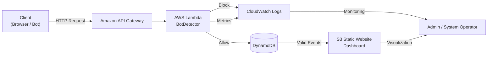
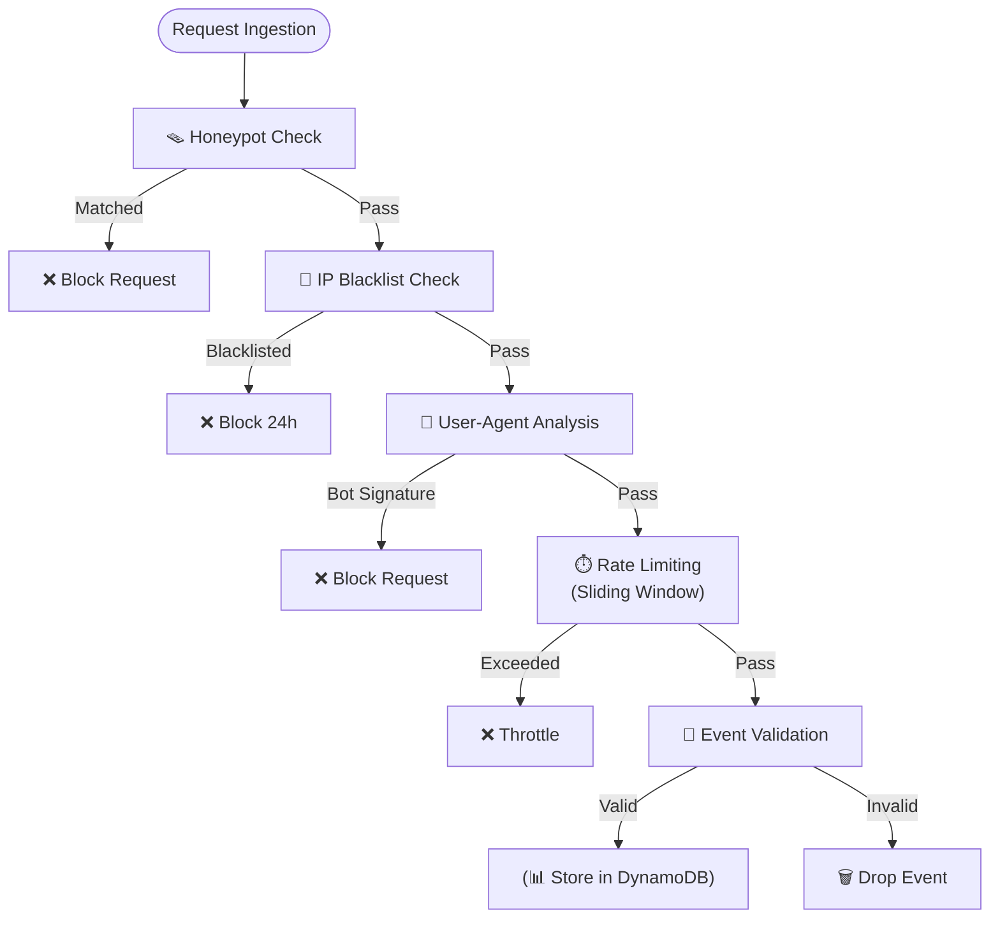

# The Digital Sieve Optimizing Infrastructure Costs via Serverless Bot Defense
Event-driven Bot Detection System built with API Gateway, AWS Lambda and DynamoDB. Implements 5-layer rule-based filtering to intercept malicious requests at the edge. Designed for extreme cost-efficiency ($1-2/1M requests) and automated scalability.

---

## 🚀 1. บทนำ (Introduction)

### 🌐 1.1 สภาพแวดล้อมและปัญหา (The Problem)

ในยุคที่การเปลี่ยนผ่านสู่ดิจิทัลเกิดขึ้นอย่างรวดเร็ว แพลตฟอร์ม **E-commerce** และระบบ **Analytics** ต้องเผชิญกับความท้าทายจากปริมาณทราฟฟิกที่มีความผันผวนสูง (High Volatility) และไม่สามารถคาดการณ์ได้ล่วงหน้า

หนึ่งในภัยเงียบที่สำคัญที่สุด คือ **บอท (Bots)** ซึ่งเป็นซอฟต์แวร์อัตโนมัติที่พยายามปลอมแปลงตัวตนเป็นผู้ใช้งานจริง (Spoofing) เพื่อแทรกซึมเข้าสู่ระบบ หากไม่มีการคัดกรองที่มีประสิทธิภาพ จะก่อให้เกิดผลกระทบแบบลูกโซ่ (Chain Reaction) ดังนี้:

- **💸 Increased Infrastructure Cost**  
  ต้นทุนพุ่งสูงจากการใช้ทรัพยากรประมวลผล (Compute) และพื้นที่จัดเก็บข้อมูล (Storage) ไปกับ Request ที่ไม่มีมูลค่าทางธุรกิจ

- **📉 Distorted Analytics**  
  ข้อมูลขยะ (Garbage Data) ปะปนในระบบ ส่งผลให้รายงานวิเคราะห์ผิดเพี้ยน และนำไปสู่การตัดสินใจเชิงกลยุทธ์ที่ผิดพลาด

- **🛡️ Late-stage Detection Limitation**  
  การตรวจจับที่เกิดขึ้นชั้นในของระบบ (Core System) ทำให้โครงสร้างพื้นฐานรับภาระตั้งแต่ต้นทางโดยไม่จำเป็น

### 💡 1.2 แนวคิด “The Digital Sieve”

โครงการนี้นำเสนอจุดเปลี่ยนเชิงกลยุทธ์ผ่านแนวคิด **“The Digital Sieve”** กลไกการคัดกรองบอทแบบเรียลไทม์ที่เน้นการสกัดกั้นภัยคุกคามตั้งแต่ **Ingestion Layer** สถาปัตยกรรมถูกออกแบบในรูปแบบ 
**Event-driven Serverless บน Amazon Web Services (AWS)** เพื่อให้ระบบสามารถปรับขนาด (Auto-scaling) ได้โดยอัตโนมัติ พร้อมรักษาต้นทุนให้ต่ำที่สุด

### ⚙️ 1.3 กลไกการคัดกรองอัจฉริยะ 5 ชั้น (5-Layer Intelligent Filtering)

1. **🪤 Honeypot Detection**  
   ตรวจจับบอทผ่านเส้นทางที่ผู้ใช้งานจริงไม่มีเหตุผลจะเข้าถึง  
   เช่น `/admin`, `/.env` ซึ่งให้ค่า False Positive ใกล้ศูนย์

2. **🚫 IP Blacklist Enforcement**  
   บล็อก IP ที่มีพฤติกรรมผิดปกติแบบ Real-time เป็นเวลา 24 ชั่วโมง  
   โดยจัดเก็บสถานะไว้ใน **Amazon DynamoDB**

3. **🤖 User-Agent Signature Analysis**  
   วิเคราะห์ User-Agent เพื่อระบุเครื่องมืออัตโนมัติ  
   เช่น `curl`, `python-requests`, หรือ Bot Framework อื่น ๆ

4. **⏱️ Rate Limiting (Sliding Window)**  
   จำกัดอัตราการส่ง Request ไม่เกิน **10 Requests ต่อ 60 วินาที**  
   เพื่อป้องกันการโจมตีแบบ Burst หรือ Brute-force

5. **💾 Event Persistence & Validation**  
   ยืนยันความถูกต้องขั้นสุดท้าย และบันทึกเฉพาะ **Valid Events** ลงสู่ฐานข้อมูลเท่านั้น

### 💎 1.4 ความคุ้มค่าและมาตรฐานระดับ Enterprise

ระบบถูกออกแบบเพื่อสร้างคุณค่าเชิงธุรกิจควบคู่กับความยั่งยืนระยะยาว:

- **💰 Micro-Cost Architecture** ต้นทุนการดำเนินงานต่ำมาก ≈ **$2.00 ต่อ 1 ล้าน Requests**

- **🏗️ AWS Well-Architected Framework** สอดคล้องกับทั้ง **6 เสาหลัก** โดยเฉพาะด้าน:
  - Cost Optimization (Pay-as-you-go)
  - Sustainability (ลดพลังงานและทรัพยากรที่สูญเสียไปกับข้อมูลขยะ)

---

## 🎯 2. วัตถุประสงค์ของโครงการ (Project Objectives)

1. เพื่อสกัดกั้นบอทตั้งแต่ชั้น **Data Ingestion Layer** ก่อนที่ข้อมูลขยะจะเข้าสู่ระบบประมวลผลหลัก (Core System)

2. ออกแบบสถาปัตยกรรมระบบโดยใช้ **Event-driven & Serverless Computing** เพื่อรองรับโหลดแบบฉับพลัน โดยไม่ต้องตั้งเซิร์ฟเวอร์ล่วงหน้า

3. ระบบสามารถตัด Request ที่ไม่มีมูลค่าทางธุรกิจตั้งแต่ต้นทาง เพื่อลด Infrastructure Cost และเพิ่ม **Data Purity** สำหรับงาน Analytics

---

## 🏗️ 3. สถาปัตยกรรมระบบ (System Architecture)

ระบบถูกออกแบบภายใต้แนวคิด **Event-driven Serverless Architecture บน AWS** เพื่อให้ทุกองค์ประกอบทำงานร่วมกันอย่างยืดหยุ่น อัตโนมัติ และมีความทนทานสูง

### 🛠️ ส่วนประกอบหลักของระบบ (Core Components)

- **🌐 Amazon API Gateway** ทำหน้าที่เป็น Entry Point สำหรับรับ HTTP Requests ทั้งหมดจาก Client

- **⚡ AWS Lambda — BotDetector** Processing Engine หลัก บรรจุตรรกะการคัดกรองบอททั้ง 5 ชั้น

- **📊 Amazon DynamoDB** ฐานข้อมูล NoSQL แบบ Single-table Design ใช้จัดเก็บ:
  - IP Blacklist
  - Valid Events

- **📈 Amazon CloudWatch** ระบบ Logging & Monitoring รองรับ Audit Trail และ Behavioral Analysis

- **💻 Amazon S3 (Static Website Hosting)** ใช้ Deploy Dashboard สำหรับแสดงผลสถิติการคัดกรองแบบ Real-time

### 🔄 System Architecture Diagram

### 🤖 กระบวนการคัดกรองคำของ AWS Lambda BotDetector

---

