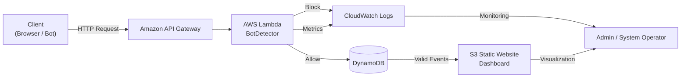
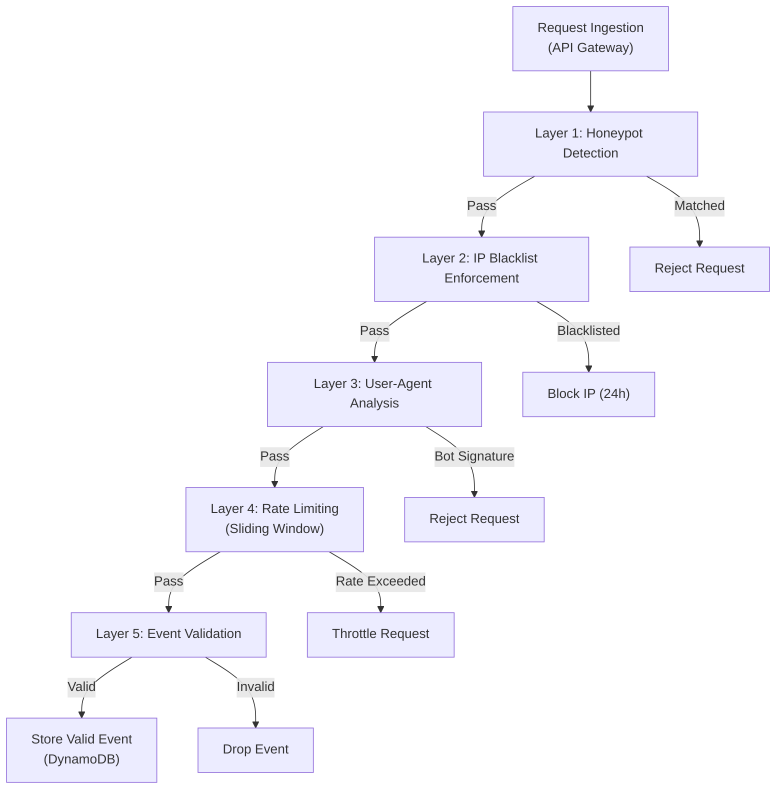

# The Digital Sieve Optimizing Infrastructure Costs via Serverless Bot Defense
Event-driven Bot Detection System built with API Gateway, AWS Lambda and DynamoDB. Implements 5-layer rule-based filtering to intercept malicious requests at the edge. Designed for extreme cost-efficiency ($1-2/1M requests) and automated scalability.

---

## 🚀 1. บทนำ (Introduction)

### 🌐 1.1 สภาพแวดล้อมและปัญหา (The Problem)

ในยุคที่การเปลี่ยนผ่านสู่ดิจิทัลเกิดขึ้นอย่างรวดเร็ว แพลตฟอร์ม **E-commerce** และระบบ **Analytics** ต้องเผชิญกับความท้าทายจากปริมาณทราฟฟิกที่มีความผันผวนสูง (High Volatility) และไม่สามารถคาดการณ์ได้ล่วงหน้า

หนึ่งในภัยเงียบที่สำคัญที่สุด คือ **บอท (Bots)** ซึ่งเป็นซอฟต์แวร์อัตโนมัติที่พยายามปลอมแปลงตัวตนเป็นผู้ใช้งานจริง (Spoofing) เพื่อแทรกซึมเข้าสู่ระบบ หากไม่มีการคัดกรองที่มีประสิทธิภาพ จะก่อให้เกิดผลกระทบแบบลูกโซ่ (Chain Reaction) ดังนี้:

- **Increased Infrastructure Cost** ต้นทุนพุ่งสูงจากการใช้ทรัพยากรประมวลผล (Compute) และพื้นที่จัดเก็บข้อมูล (Storage) ไปกับ Request ที่ไม่มีมูลค่าทางธุรกิจ

- **Distorted Analytics** ข้อมูลขยะ (Garbage Data) ปะปนในระบบ ส่งผลให้รายงานวิเคราะห์ผิดเพี้ยน และนำไปสู่การตัดสินใจเชิงกลยุทธ์ที่ผิดพลาด

- **Late-stage Detection Limitation** การตรวจจับที่เกิดขึ้นชั้นในของระบบ (Core System) ทำให้โครงสร้างพื้นฐานรับภาระตั้งแต่ต้นทางโดยไม่จำเป็น

---

### 💡 1.2 แนวคิด “The Digital Sieve”

โครงการนี้นำเสนอจุดเปลี่ยนเชิงกลยุทธ์ผ่านแนวคิด **“The Digital Sieve”** กลไกการคัดกรองบอทแบบเรียลไทม์ 5 ชั้น (5-Layer Intelligent Filtering) ที่เน้นการสกัดกั้นภัยคุกคามตั้งแต่ **Ingestion Layer** สถาปัตยกรรมถูกออกแบบในรูปแบบ 
**Event-driven Serverless บน Amazon Web Services (AWS)** เพื่อให้ระบบสามารถปรับขนาด (Auto-scaling) ได้โดยอัตโนมัติ พร้อมรักษาต้นทุนให้ต่ำที่สุด

---

### 💎 1.3 ความคุ้มค่าและมาตรฐานระดับ Enterprise

ระบบถูกออกแบบเพื่อสร้างคุณค่าเชิงธุรกิจควบคู่กับความยั่งยืนระยะยาว:

- **Micro-Cost Architecture** ต้นทุนการดำเนินงานต่ำมาก ≈ **$2.00 ต่อ 1 ล้าน Requests**

- **AWS Well-Architected Framework** สอดคล้องกับทั้ง **6 เสาหลัก** โดยเฉพาะด้าน:
  - Cost Optimization (Pay-as-you-go)
  - Sustainability (ลดพลังงานและทรัพยากรที่สูญเสียไปกับข้อมูลขยะ)

---

## 🎯 2. วัตถุประสงค์ของโครงการ (Project Objectives)

1. เพื่อสกัดกั้นบอทตั้งแต่ชั้น **Data Ingestion Layer** ก่อนที่ข้อมูลขยะจะเข้าสู่ระบบประมวลผลหลัก (Core System)

2. ออกแบบสถาปัตยกรรมระบบโดยใช้ **Event-driven & Serverless Computing** เพื่อรองรับโหลดแบบฉับพลัน โดยไม่ต้องตั้งเซิร์ฟเวอร์ล่วงหน้า

3. ระบบสามารถตัด Request ที่ไม่มีมูลค่าทางธุรกิจตั้งแต่ต้นทาง เพื่อลด Infrastructure Cost และเพิ่ม **Data Purity** สำหรับงาน Analytics

---

## 🏗️ 3. สถาปัตยกรรมระบบ (System Architecture)

ระบบถูกออกแบบภายใต้แนวคิด **Event-driven Serverless Architecture บน AWS** เพื่อให้ทุกองค์ประกอบทำงานร่วมกันอย่างยืดหยุ่น อัตโนมัติ และมีความทนทานสูง

### 🛠️ 3.1 ส่วนประกอบหลักของระบบ (Core Components)

- **1. Amazon API Gateway** ทำหน้าที่เป็น Entry Point สำหรับรับ HTTP Requests ทั้งหมดจาก Client

- **2. AWS Lambda - BotDetector** Processing Engine หลัก บรรจุตรรกะการคัดกรองบอททั้ง 5 ชั้น

- **3. Amazon DynamoDB** ฐานข้อมูล NoSQL แบบ Single-table Design ใช้จัดเก็บ:
  - IP Blacklist
  - Valid Events

- **4. Amazon CloudWatch** ระบบ Logging & Monitoring รองรับ Audit Trail และ Behavioral Analysis

- **5. Amazon S3 (Static Website Hosting)** ใช้ Deploy Dashboard สำหรับแสดงผลสถิติการคัดกรองแบบ Real-time

---

### 🔄 3.2 System Architecture Diagram


---

### 🤖 3.3 กระบวนการคัดกรองบอทของ AWS Lambda BotDetector 5 ชั้น (5-Layer Intelligent Filtering)

### 🪤 Layer 1: Honeypot
เลเยอร์ที่เร็วที่สุดและแม่นยำที่สุด โดยการตรวจสอบ Path ที่ Client เรียกเข้ามา หากตรงกับ "กับดัก" ที่ตั้งไว้ (เช่น /admin, /.env, /wp-login.php) ระบบจะตัดสินว่าเป็นบอททันที
- Zero-False-Positive: ผู้ใช้งานจริงไม่มีเหตุผลที่จะเข้าถึง Path เหล่านี้
- Action: บล็อก IP เข้าสู่ Blacklist ทันที และตอบกลับด้วย 404 Not Found (Stealth Mode)

**ฟังก์ชัน is_honeypot_path()** 

```python
def is_honeypot_path(path):
    if not path:
        return False
    
    path_lower = path.lower()
    
    for trap in HONEYPOT_PATHS:
        if path_lower.startswith(trap):
            return True
    
    return False
```

---


### 🚫 Layer 2: IP Blacklist
ระบบจะตรวจสอบ IP Address ในฐานข้อมูล RateLimitTracker ว่าเคยถูกแบนจากการติดกับดัก Honeypot หรือไม่
- Efficiency: หากพบใน Blacklist ระบบจะยุติการทำงานทันทีโดยไม่ต้องไปตรวจสอบเลเยอร์ที่เหลือ
- Auto-Expiry: ใช้ฟีเจอร์ TTL ของ DynamoDB เพื่อลบข้อมูลที่หมดอายุ (24 ชั่วโมง) อัตโนมัติ

**ฟังก์ชัน is_blacklisted(ip_address)**
  
```python
def is_blacklisted(ip_address):
    try:
        bl_key = f"BL#{ip_address}"
        response = rate_limit_table.get_item(Key={"ip_address": bl_key})
        item = response.get("Item")
        
        if not item:
            return None
        
        expires_at = int(item.get("expires_at", 0))
        if expires_at < int(time.time()):
            return None  # หมดอายุแล้ว
        
        return item.get("reason", "blacklisted")
    except Exception as e:
        print(f"Error checking blacklist: {e}")
        return None
```

**ฟังก์ชัน add_to_blacklist(ip_address, reason)**

```python
def add_to_blacklist(ip_address, reason):
    try:
        bl_key = f"BL#{ip_address}"
        now = int(time.time())
        expires_at = now + BLACKLIST_DURATION
        
        rate_limit_table.put_item(Item={
            "ip_address": bl_key,
            "blacklisted": True,
            "reason": reason,
            "banned_at": now,
            "expires_at": expires_at
        })
        print(f"[BLACKLIST] Added {ip_address} - reason: {reason}")
    except Exception as e:
        print(f"Error adding to blacklist: {e}")
```

---

### 🤖 Layer 3: User-Agent Analysis
ตรวจสอบข้อมูล User-Agent ใน Header เพื่อค้นหา Signature ของซอฟต์แวร์อัตโนมัติมาตรฐาน
- Detection: ตรวจจับคำสำคัญเช่น curl, wget, python-requests, scrapy, bot, crawler
- Case Insensitive: แปลงข้อความเป็นตัวพิมพ์เล็กทั้งหมดก่อนตรวจสอบเพื่อให้ครอบคลุมทุกรูปแบ

**ฟังก์ชัน is_bot_user_agent()**

```python
def is_bot_user_agent(user_agent):
    if not user_agent:
        return "empty_user_agent"
    
    user_agent_lower = user_agent.lower()
    
    for bot_sig in BOT_USER_AGENTS:
        if bot_sig in user_agent_lower:
            return f"bot_signature: {bot_sig}"
    
    return None
```

---

### ⏱️ Layer 4: Rate Limiting
ป้องกันการยิง Request ถี่เกินไปโดยใช้ตรรกะ Sliding Window
- Threshold: อนุญาตสูงสุด 10 Requests ต่อรอบเวลา 60 วินาที
- Stateful Tracking: บันทึกตัวนับ (Counter) และเวลาเริ่มต้นหน้าต่างลงใน DynamoDB แยกตาม IP
- Action: หากเกินกำหนดจะตอบกลับด้วยสถานะ 429 Too Many Requests

**ฟังก์ชัน check_rate_limit()**

```python
def check_rate_limit(ip_address):
    try:
        now = int(time.time())
        window_start = now - RATE_LIMIT_WINDOW
        
        response = rate_limit_table.get_item(
            Key={"ip_address": ip_address}
        )
        item = response.get("Item")
        
        if not item:
            rate_limit_table.put_item(Item={
                "ip_address": ip_address,
                "count": 1,
                "window_start": now,
                "expires_at": now + RATE_LIMIT_WINDOW * 2
            })
            return True, 1
        
        item_window_start = int(item.get("window_start", 0))
        count = int(item.get("count", 0))
        
        if item_window_start < window_start:
            rate_limit_table.put_item(Item={
                "ip_address": ip_address,
                "count": 1,
                "window_start": now,
                "expires_at": now + RATE_LIMIT_WINDOW * 2
            })
            return True, 1
        
        new_count = count + 1
        if new_count > RATE_LIMIT_MAX_REQUESTS:
            return False, new_count
        
        rate_limit_table.update_item(
            Key={"ip_address": ip_address},
            UpdateExpression="SET #c = :c",
            ExpressionAttributeNames={"#c": "count"},
            ExpressionAttributeValues={":c": new_count}
        )
        return True, new_count
    except Exception as e:
        print(f"Error in rate limit: {e}")
        return True, 0

```

---

### 💾 Layer 5: Event Persistence
เลเยอร์สุดท้ายสำหรับ Request ที่ผ่านการทดสอบครบทุกด่าน
- Data Integrity: บันทึกข้อมูลที่สะอาดลงในตาราง ValidEvents พร้อม Request ID ที่ไม่ซ้ำกัน (UUID)
- Comprehensive Logging: เก็บข้อมูลทั้ง IP, Path, Method, User-Agent และ Body Size เพื่อใช้ในการวิเคราะห์เชิงลึก

**ฟังก์ชัน save_valid_event()**

```python
def save_valid_event(request_id, ip_address, user_agent, path, method, body_size):
    try:
        timestamp = datetime.now(timezone.utc).isoformat()
        valid_events_table.put_item(Item={
            "request_id": request_id,
            "timestamp": timestamp,
            "ip_address": ip_address,
            "user_agent": user_agent,
            "path": path,
            "method": method,
            "body_size": body_size
        })
    except Exception as e:
        print(f"Error saving event: {e}")
```

---

### flowchart แสดงการตัดสินใจของ Lambda BotDetector



---

#### Example Request Scenarios

**Case 1. Normal Request (Expected to Pass)**
```python
curl -X POST https://<api-id>.execute-api.<region>.amazonaws.com/prod/track \
  -H "User-Agent: Mozilla/5.0" \
  -d '{"event":"page_view"}'
```
**ผลลัพธ์:** ผ่านทุก filtering layer Event ถูก store ลง DynamoDB

**Case 2. Honeypot Access (Blocked Immediately)**
```python
curl https://<api-id>.execute-api.<region>.amazonaws.com/.env
```
**ผลลัพธ์:** ถูก catch ที่ Layer 1 Lambda terminate early และ ไม่มี downstream cost


**Case 3. Bot User-Agent (Rejected)**
```python
curl -H "User-Agent: python-requests/2.31" \
  https://<api-id>.execute-api.<region>.amazonaws.com/prod/track
```
**ผลลัพธ์:** ถูก Blocked at Layer 3 IP ยังไม่ถูก ban (behavioral vs enforcement)

**Case 4. Rate Limit Exceeded (Throttled)**
```python
for i in {1..20}; do
  curl https://<api-id>.execute-api.<region>.amazonaws.com/prod/track
done
```
**ผลลัพธ์:** Throttled at Layer 4 Event ไม่เข้าสู่ persistence

---


